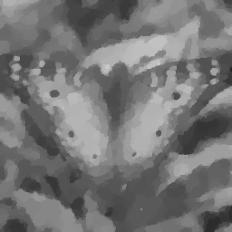

# Total Variation Regularisation with Spatially Variable Lipschitz Constraints

**Authors**: Yury Korolev and Simone Parisotto

**Other Authors** 
Martin Burger
Carola-Bibiane Schönlieb

**Version 1.0**

**Date: 05/12/2019**

This is a companion software for the [submission](https://arxiv.org/pdf/1912.XXXXX.pdf):

```
@article{BurKorParSch19,
 author        = {Burger, Marting and Korolev, Yury and Parisotto, Simone and Sch\"{o}nlieb, Carola-Bibiane} ,
 title         = {{Total Variation Regularisation with Spatially Variable Lipschitz Constraints}},
 year          = {2019},
 month         = {oct}, 
 journal       = {ArXiv e-prints},
 archivePrefix = {arXiv},
 eprint        = {1912.XXXXX},
}
```

#### Example
Image with Gaussian noise  (20%, std=51/255) vs. TV vs. TGV vs. TVpwL from over-TV vs. TVpwL from GT

      


### License
[BSD 3-Clause License](https://opensource.org/licenses/BSD-3-Clause)
